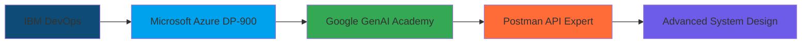

# <div align="center">🚀 **OMKAR MAHESH** 🚀</div>

<div align="center">

### `Cloud Architect` • `DevOps Engineer` • `DSA Expert`

*Mastering the synergy between **algorithms**, **infrastructure**, and **automation***

---

[](https://portfolio-omkar-fvx6.vercel.app/)
[](https://www.linkedin.com/in/omkar-mahesh-a99b70289/)
[](https://github.com/omkarmm19)
[](https://leetcode.com/u/omkarmm19/)
[](mailto:omkarmahesh12345@gmail.com)

</div>

---

## 🎯 **MISSION STATEMENT**

> **Building scalable cloud infrastructure with algorithmic precision**  
> From optimizing O(log n) solutions to orchestrating Kubernetes clusters—I architect systems that perform at scale

**Current Focus:** `VIT Bhopal` • `Cloud Computing & Automation` • `CGPA: 8.38`

---

## ⚡ **CORE COMPETENCIES**

<div align="center">

### 🧠 **ALGORITHMIC MASTERY**
```java
// 100+ Days of Consistent Problem Solving
class DSAExpert {
    String[] languages = {"Java", "Python", "C++"};
    String specialty = "Advanced Problem Solving & Optimization";
    boolean completed100DaysChallenge = true;
}
```

### ☁️ **CLOUD ARCHITECTURE**
```yaml
infrastructure:
  primary_clouds: [AWS, GCP]
  specialties: [Serverless, Microservices, Cloud-Native]
  approach: "Infrastructure as Code"
```

### 🔧 **DEVOPS AUTOMATION**
```dockerfile
# Continuous Integration • Continuous Deployment
FROM developer:expert
RUN install-devops-tools
COPY automation-scripts ./pipelines/
EXPOSE efficiency scalability reliability
```

</div>

---

## 🛠️ **TECHNOLOGY ARSENAL**

<div align="center">

### **🔥 CORE LANGUAGES**


### **☁️ CLOUD & INFRASTRUCTURE**


### **🔄 DEVOPS PIPELINE**


### **💻 FULL-STACK DEVELOPMENT**


### **🤖 AI & AUTOMATION**


</div>

---

## 🏆 **ELITE ACHIEVEMENTS**

<div align="center">

| 🥇 **RECOGNITION** | 📊 **IMPACT** |
|:---:|:---:|
| **1st Rank** - Google GenAI Exchange 2025 | Leading Innovation in AI Integration |
| **100 Days** - LeetCode DSA Challenge | Advanced Algorithmic Problem Solving |
| **GSSOC 2024** - Open Source Contributor | Community Impact & Code Quality |
| **Multi-Cloud Certified** | AWS • GCP • Azure Fundamentals |

</div>

---

## 📈 **PROFESSIONAL CERTIFICATIONS**

<div align="center">



</div>

---

## 🎯 **CURRENT LEARNING TRAJECTORY**

<div align="center">

### **🚀 ADVANCING EXPERTISE IN:**

**`Kubernetes Orchestration`** • **`Advanced RAG Pipelines`** • **`Infrastructure as Code`**  
**`System Design at Scale`** • **`Cloud Security`** • **`ML Ops Integration`**

</div>

---

## 💡 **PHILOSOPHY**

<div align="center">

### *"Code that scales. Infrastructure that performs. Algorithms that optimize."*

**🎯 Building Tomorrow's Tech Infrastructure Today**

```bash
while (learning) {
    implement();
    optimize();
    scale();
    repeat();
}
```

</div>

---

<div align="center">

### **🤝 CONNECT & COLLABORATE**

*Ready to architect the future of cloud-native applications?*

[](mailto:omkarmahesh12345@gmail.com)

---

**⭐ If you find my work valuable, consider starring my repositories!**

</div>
